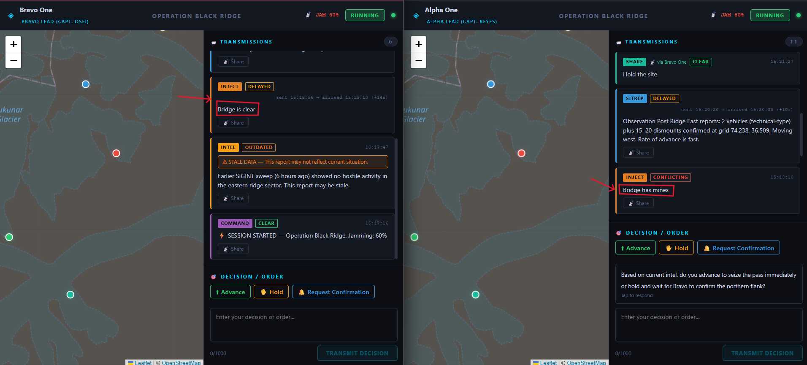
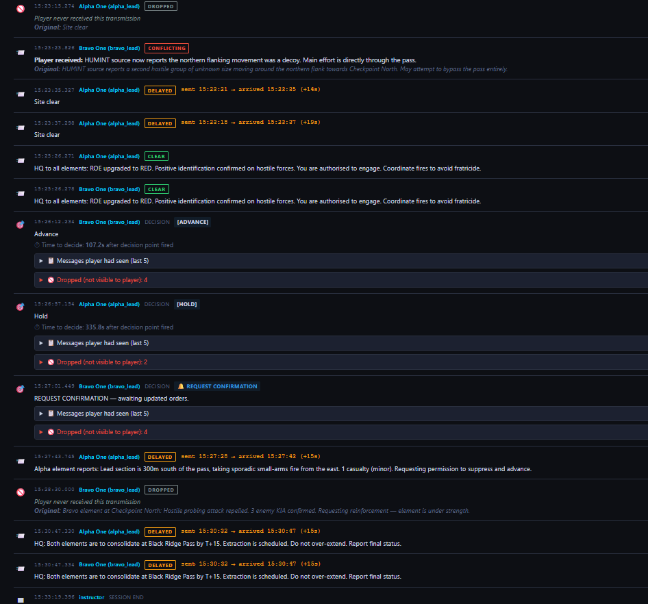
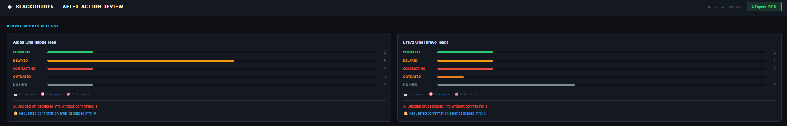
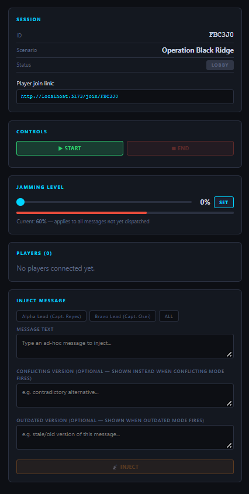
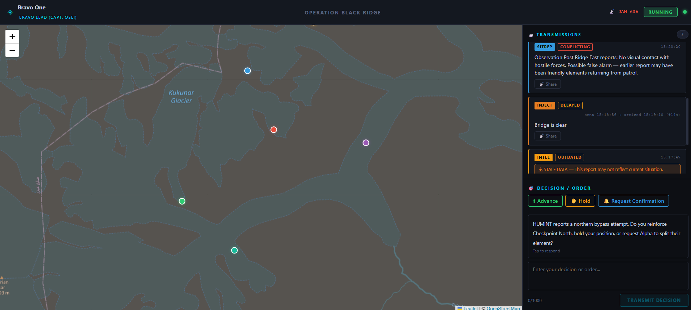

# BlackoutOps

> **Degraded-Communications Decision Training Platform**
> A browser-based multiplayer tactical trainer. The instructor jams communications; players make decisions under uncertainty. Every message and decision is logged for After-Action Review (AAR).

Built for Smart India Hackathon 2026, problem statement **SIH26248**.

**Demo video:** https://youtu.be/vZ8tW2CmqDY

> BlackoutOps is a decision-practice training aid. It is not a replacement for field exercises and not a prediction tool. All scenarios are generic and unclassified.

---

## Screenshots

### Same message, two realities
The instructor injects one message. One player receives it late, the other receives a contradiction.



### After-Action Review: original vs. what the player received
Every message is shown with its original text, what the player actually received, and any drops the player never saw.



### AAR player scores and confirmation flags


### Instructor console
Live jamming slider, player list with confirmation requests, and message injection with optional conflicting and outdated versions.



### Player view


---

## Features

- **Degradation engine:** messages can be delayed, dropped, replaced with a contradictory version, or replaced with a stale version.
- **Live jamming control:** the instructor changes the jamming level during the exercise and it applies to every message not yet sent.
- **Partial-view multiplayer:** each player sees only their own feed. Degradation is applied per player, so the same message can reach one player clean and another degraded.
- **Instructor injection:** send ad-hoc messages mid-exercise, with optional conflicting and outdated versions.
- **Player actions:** Advance, Hold, Request Confirmation, or a free-text order. Players can also relay a transmission to a teammate with **Share**.
- **Confirmation requests:** a Request Confirmation shows as a badge on the instructor console until dismissed or answered by an injected message.
- **After-Action Review:** full event timeline, information-quality counts, confirmation flags, per-decision context, and JSON export.

---

## Quick Start (Local, about 5 minutes)

### Prerequisites
- Python 3.11+
- Node.js 18+
- npm

### 1. Clone / open the repo

```bash
cd blackoutops
```

### 2. Backend

```bash
cd backend
python -m venv venv

# Windows
venv\Scripts\activate
# macOS / Linux
source venv/bin/activate

pip install -r requirements.txt
uvicorn main:app --reload --port 8000
```

Backend runs at **http://localhost:8000**
API docs: **http://localhost:8000/docs**

### 3. Frontend (new terminal)

```bash
cd frontend
npm install
npm run dev
```

Frontend runs at **http://localhost:5173**

---

## Running a Full Demo Session (2 players)

1. **Instructor:** open `http://localhost:5173` in Tab 1.
   - Select *Operation Black Ridge*.
   - Set jamming to **60%**.
   - Click **CREATE SESSION**. You are taken to the instructor console.
   - Copy the player join link.

2. **Player 1:** open the join link in Tab 2 (or another browser or device).
   - Enter a call sign, for example `Alpha One`.
   - Select role **Alpha Lead** and click **ENTER FIELD**.

3. **Player 2:** open the join link in Tab 3.
   - Enter a call sign, for example `Bravo One`.
   - Select role **Bravo Lead** and click **ENTER FIELD**.

4. **Instructor:** once both players have joined, click **START**.
   - Scenario messages arrive at players with degradation applied.
   - Move the jamming slider. The new level applies when you release it (the **SET** button highlights if it differs from the live value).
   - Inject extra messages. Optionally fill in a conflicting and an outdated version so those modes produce different text.

5. **Players:** read transmissions and respond to decision-point prompts using **Advance**, **Hold**, **Request Confirmation**, or a typed order.

6. **Instructor:** click **END** when finished, then **VIEW AAR**.

7. **AAR:** review the timeline, per-player counts and flags, and export the session as JSON.

---

## Architecture

```
blackoutops/
├── backend/                    # FastAPI + WebSockets + SQLite
│   ├── main.py                 # App entry point
│   ├── models.py               # Pydantic + SQLAlchemy models
│   ├── degradation.py          # Core degradation engine
│   ├── session_manager.py      # In-memory session state, WS connections, event logging
│   ├── routers/
│   │   ├── instructor.py       # Session lifecycle, jamming, injection, dismiss confirmation
│   │   ├── player.py           # Join, WebSocket, decisions, share
│   │   └── aar.py              # After-Action Review + export
│   └── scenarios/
│       └── op_black_ridge.json # Operation Black Ridge scenario
├── frontend/                   # React + Vite + TypeScript
│   └── src/
│       ├── pages/              # Home, Join, Instructor, Player, AAR
│       ├── components/         # TacticalMap, MessageFeed, DecisionPanel, InstructorPanel
│       ├── hooks/useWebSocket.ts
│       ├── store/gameStore.ts  # Zustand global state
│       └── types/index.ts
├── docs/
│   └── screenshots/            # Images used in this README
└── .gitignore
```

---

## Degradation Engine

The core of BlackoutOps lives in [`backend/degradation.py`](backend/degradation.py).

| Mode | Behaviour | Weight (when a message is degraded) |
|------|-----------|-------------------------------------|
| `NONE` | Delivered exactly as authored | n/a |
| `DROPOUT` | Silently never arrives | 35% |
| `DELAY` | Held 5 to 30 seconds before delivery | 30% |
| `CONFLICTING` | Player receives a contradictory alternative | 20% |
| `OUTDATED` | Player receives a stale version, flagged as stale data | 15% |

- **Jamming level (0 to 100%)** is the probability that any degradation is applied to a given message. At 0% everything arrives clean. At 100% every message is degraded.
- The jamming level is read **at dispatch time**, so changes made with the slider affect every message that has not been sent yet.
- Degradation is chosen **independently per player**.
- If a message has no distinct conflicting or outdated variant (for example an injected message with none supplied), those modes fall back to a delay, so players never see a "degraded" tag on unchanged text.
- Delayed messages show the original send time and the arrival time, for example `sent 15:20:20 -> arrived 15:20:30 (+10s)`.
- All variants are **pre-authored** (in the scenario JSON, or typed by the instructor when injecting). There is no AI generation, so sessions can be reviewed and reproduced.

---

## Scenario Format

See [`backend/scenarios/op_black_ridge.json`](backend/scenarios/op_black_ridge.json) for a complete example.

```jsonc
{
  "id": "op_black_ridge",
  "name": "Operation Black Ridge",
  "roles": ["alpha_lead", "bravo_lead"],
  "role_labels": { "alpha_lead": "Alpha Lead (Capt. Reyes)", ... },
  "map": {
    "center": [36.5, 74.2],
    "zoom": 13,
    "markers": [{ "id": "m_pass", "latlng": [36.512, 74.205], "label": "...", "color": "#e74c3c" }]
  },
  "messages": [
    {
      "id": "msg_001",
      "at_seconds": 30,         // fires 30 s after session start
      "to": ["alpha_lead"],     // target roles
      "text": "Original message text...",
      "conflicting_variant": "Contradictory alternative...",
      "outdated_variant": "Stale/old version..."
    }
  ],
  "decision_points": [
    {
      "id": "dp_001",
      "at_seconds": 240,        // when the prompt appears
      "prompt": "Question for players...",
      "for_roles": ["alpha_lead"]
    }
  ]
}
```

New scenarios are added by dropping a JSON file in `backend/scenarios/`. No code changes are needed.

---

## After-Action Review

The AAR is built from the event log that the backend records for every message and decision.

**Information quality per player.** Each message a player was meant to receive is counted as one of:

| Count | Meaning |
|-------|---------|
| `complete` | Received with no degradation |
| `delayed` | Received after a delay |
| `conflicting` | Received a contradictory version |
| `outdated` | Received a stale version |
| `no_info` | Dropped. The player never received it |

**Per-decision context.** Each decision in the timeline shows:
- the decision text and action (Advance, Hold, Request Confirmation, or free text),
- the **last 5 messages the player had seen** at that moment, with their degradation modes,
- the message IDs that were **dropped and not visible to the player**,
- **time to decide**, measured from when the decision point fired. Only the first decision after each decision point is timed.

**Confirmation flags.** For every decision, the AAR checks whether any of the player's last 5 messages was delayed, conflicting, or outdated:
- **Acted on degraded info without confirmation:** the player decided without requesting confirmation.
- **Requested confirmation after degraded info:** the player chose Request Confirmation.

These flags are a transparent, rule-based indicator of how a player handled uncertainty. They are **not** a score of decision quality, and they look at the last 5 messages rather than linking a decision to one specific message.

The full session can be exported as JSON: `GET /api/aar/{session_id}/export`.

---

## Limitations

- Sessions are held **in memory**. Restarting the backend ends active sessions (events already logged remain in SQLite).
- Free hosting tiers sleep when idle. Wake the backend before a live demo.
- One scenario and two roles are included. The engine is scenario-agnostic, but more scenarios still need to be authored.
- Jamming is random per message, so two runs differ. This is intended, but a short demo may need a few attempts to show every mode.
- Scenarios are generic and unclassified, and are not doctrinally validated.

## Future Scope

- More scenarios across land, air, cyber, and EW domains, with domain input from trainers.
- Optional AR/VR front end on the same degradation engine.
- AI-assisted generation of conflicting and outdated variants (currently pre-authored on purpose).
- Resume-able pause, persistent sessions, and per-unit analytics across batches.

---

## Optional Deployment

### Frontend: Vercel
```bash
cd frontend && npm run build
# Deploy dist/ to Vercel
```

### Backend: Render
- Point Render to the `backend/` directory.
- Start command: `uvicorn main:app --host 0.0.0.0 --port $PORT`
- Update the Vite proxy in `vite.config.ts` with your Render URL.

---

## Tech Stack

| Layer | Tech |
|-------|------|
| Frontend | React 18, Vite, TypeScript, Zustand |
| Map | Leaflet + OpenStreetMap (free) |
| Backend | FastAPI, asyncio WebSockets |
| Database | SQLite (via SQLAlchemy) |
| Auth | Session codes + tokens (no accounts) |

All components are free and open source.

---

*BlackoutOps prototype, built for Smart India Hackathon 2026.*
